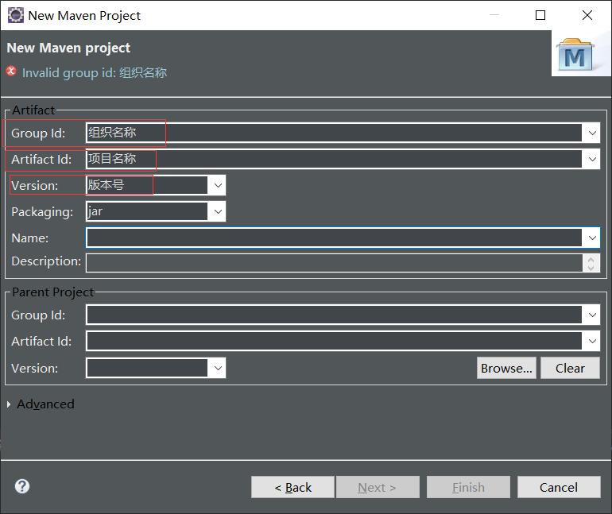
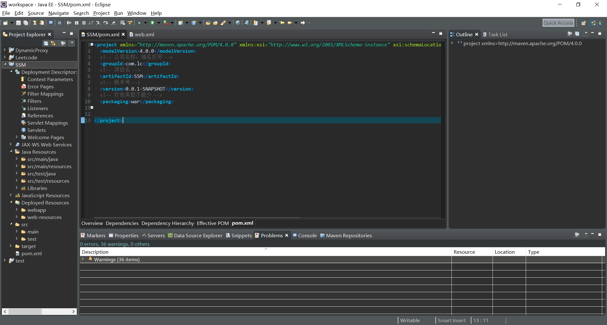

# SSM框架整合

### Maven

##### 1.安装Maven

1. 下载解压
2. 更改配置
   - 更改配置文件，设置本地仓库路径存储jar包
   - 设置镜像，提高下载速度
   - 指定jdk版本
3. 将maven添加到eclipse

##### 2.新建maven工程

##### 3.poom.xml配置文件

##### 4.maven仓库

https://mvnrepository.com/

### TomCat

##### 1.下载解压

##### 2.在eclipse上配置

### 新建web项目

##### 开始

1. 生成web.xml文件
2. 添加tomcat运行环境

##### 导入依赖

- Spring
- SpringMVC
- mybatis
- mysql
- c3p0连接池
- spring-jdbc
- junit
- log4j
- …

##### 编写配置文件

###### pom.xml

配置依赖

###### web.xml

配置前端控制器

配置加载spring配置文件

配置加载springMVC配置文件

###### spring配置文件

配置加载mybatis配置文件

bean

事务支持

###### springMVC配置文件

视图解析器

拦截器

###### mybatis配置文件 

mapper

缓存支持

##### 配置文件之间的关系

web.xml配置spring，spring MVC

spring配置文件中配置mybatis

